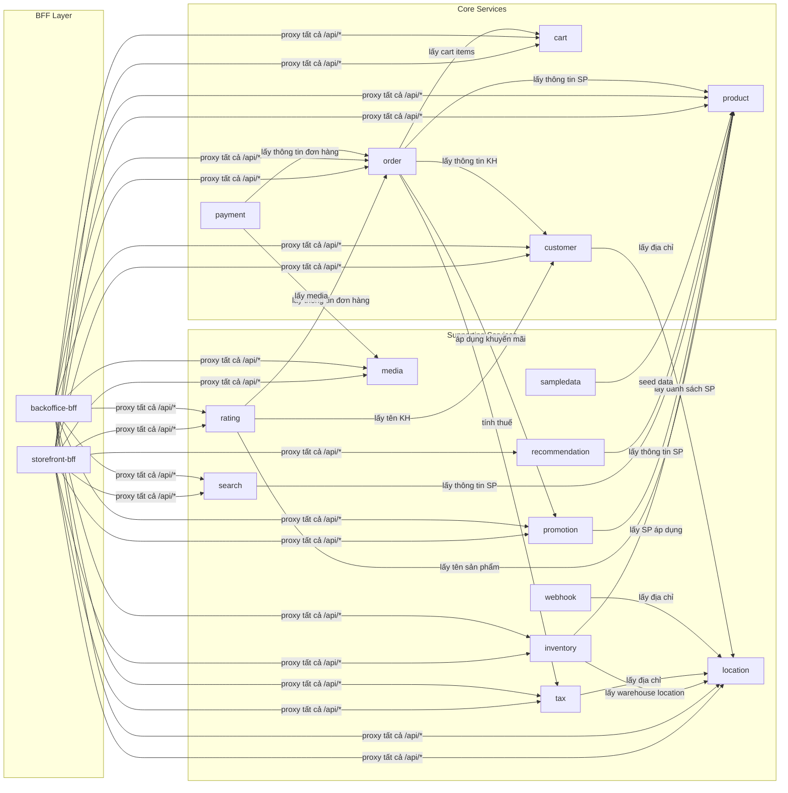
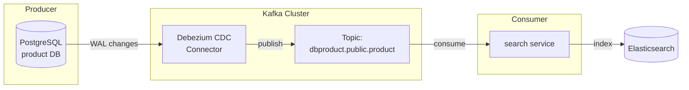
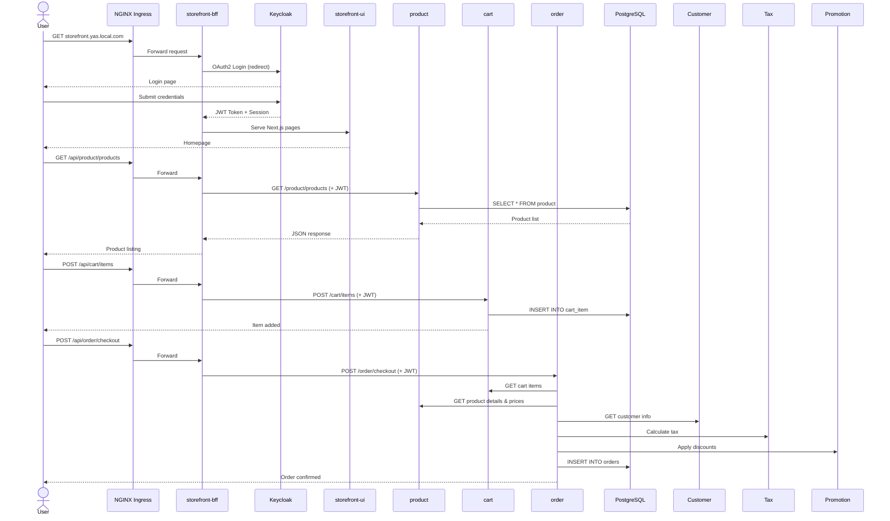
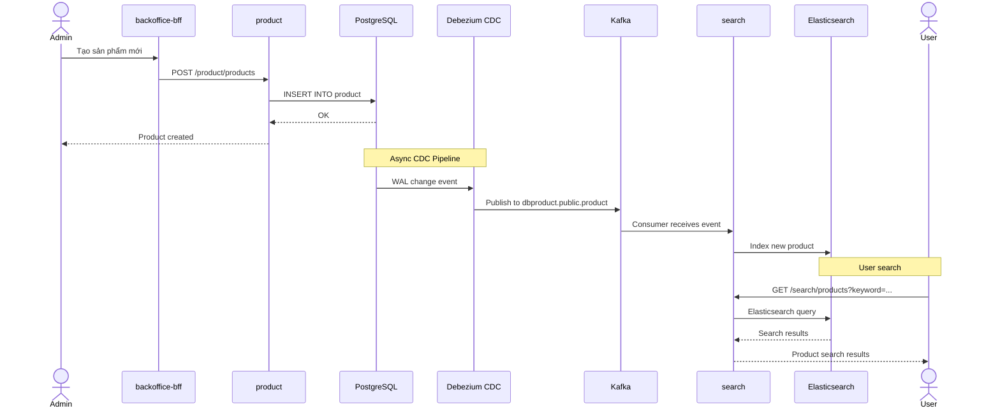
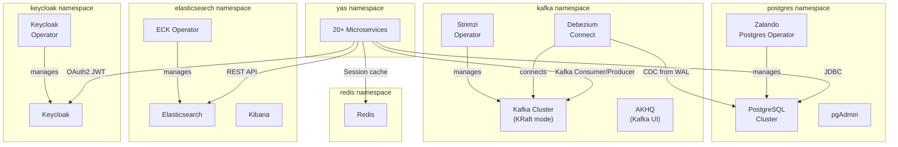

# YAS Microservices – Luồng hoạt động & Sơ đồ giao tiếp trên K8s

## I. Tổng quan kiến trúc trên Kubernetes

```mermaid
graph TB
    subgraph "Internet / Developer Machine"
        USER["👤 User Browser"]
    end

    subgraph "K8s Cluster"
        subgraph "ingress-nginx namespace"
            INGRESS["NGINX Ingress Controller<br/>(NodePort 80/443)"]
        end

        subgraph "yas namespace – Application Layer"
            direction TB
            SF_UI["storefront-ui<br/>(Next.js)"]
            BO_UI["backoffice-ui<br/>(Next.js)"]
            SF_BFF["storefront-bff<br/>(Spring Gateway)"]
            BO_BFF["backoffice-bff<br/>(Spring Gateway)"]
            
            PRODUCT["product"]
            CART["cart"]
            ORDER["order"]
            CUSTOMER["customer"]
            INVENTORY["inventory"]
            MEDIA["media"]
            LOCATION["location"]
            RATING["rating"]
            PROMOTION["promotion"]
            TAX["tax"]
            PAYMENT["payment"]
            SEARCH["search"]
            RECOMMENDATION["recommendation"]
            SAMPLEDATA["sampledata"]
            WEBHOOK["webhook"]
        end

        subgraph "keycloak namespace"
            KC["Keycloak<br/>(Identity Provider)"]
        end

        subgraph "postgres namespace"
            PG["PostgreSQL Cluster<br/>(Zalando Operator)"]
        end

        subgraph "kafka namespace"
            KAFKA["Kafka Cluster<br/>(Strimzi / KRaft)"]
            DEBEZIUM["Debezium Connect<br/>(CDC)"]
        end

        subgraph "elasticsearch namespace"
            ES["Elasticsearch<br/>(ECK Operator)"]
        end

        subgraph "redis namespace"
            REDIS["Redis"]
        end
    end

    USER -->|"storefront.yas.local.com"| INGRESS
    USER -->|"backoffice.yas.local.com"| INGRESS
    USER -->|"api.yas.local.com"| INGRESS

    INGRESS --> SF_BFF
    INGRESS --> BO_BFF

    SF_BFF --> SF_UI
    BO_BFF --> BO_UI

    SF_BFF --> PRODUCT & CART & ORDER & CUSTOMER & MEDIA & RATING & SEARCH & PROMOTION & INVENTORY & LOCATION & TAX & RECOMMENDATION
    BO_BFF --> PRODUCT & CART & ORDER & CUSTOMER & MEDIA & RATING & SEARCH & PROMOTION & INVENTORY & LOCATION & TAX

    PRODUCT --> PG
    CART --> PG
    ORDER --> PG
    CUSTOMER --> PG
    INVENTORY --> PG
    MEDIA --> PG
    LOCATION --> PG
    RATING --> PG
    PROMOTION --> PG
    TAX --> PG
    PAYMENT --> PG

    SEARCH --> ES
    SF_BFF --> REDIS
    BO_BFF --> REDIS

    PRODUCT --> KAFKA
    SEARCH --> KAFKA
    DEBEZIUM --> PG
    DEBEZIUM --> KAFKA
```



---

## II. Giải thích chi tiết từng layer

### Layer 1: Ingress – Điểm vào duy nhất

```
User Browser ──► NGINX Ingress Controller (NodePort)
                    │
                    ├── storefront.yas.local.com ──► storefront-bff
                    ├── backoffice.yas.local.com ──► backoffice-bff
                    ├── api.yas.local.com ──────────► swagger-ui
                    ├── identity.yas.local.com ─────► keycloak
                    ├── pgadmin.yas.local.com ──────► pgadmin
                    └── kibana.yas.local.com ──────► kibana
```

- NGINX Ingress được expose qua **NodePort** trên Worker Node
- Developer thêm IP Worker Node vào `/etc/hosts` để truy cập qua domain name
- Tất cả traffic từ bên ngoài **bắt buộc** đi qua Ingress → không service nào bị expose trực tiếp

### Layer 2: BFF (Backend For Frontend) – API Gateway

YAS sử dụng pattern **BFF (Backend For Frontend)**. Có 2 BFF service:

| BFF | Frontend | Vai trò |
|-----|----------|---------|
| `storefront-bff` | `storefront-ui` | Gateway cho khách hàng (mua hàng, xem sản phẩm) |
| `backoffice-bff` | `backoffice-ui` | Gateway cho quản trị viên (quản lý sản phẩm, đơn hàng) |

**Cách BFF hoạt động:**

```
Browser ──► Ingress ──► storefront-bff (Spring Cloud Gateway)
                            │
                            ├── /api/product/** ──► product service
                            ├── /api/cart/**    ──► cart service
                            ├── /api/order/**   ──► order service
                            ├── /api/media/**   ──► media service
                            ├── ...
                            └── /**             ──► storefront-ui (Next.js SSR)
```

- BFF nhận request từ browser, thêm **OAuth2 Token** (TokenRelay filter) rồi forward tới backend service tương ứng
- BFF quản lý **session** thông qua Redis (`spring.data.redis`)
- BFF xác thực user qua **Keycloak** (OAuth2 client credentials)
- Mỗi route trong BFF được map 1:1 với một backend service qua `RewritePath` filter

### Layer 3: Backend Microservices – Business Logic

Mỗi service có **1 database riêng** (Database per Service pattern) và giao tiếp với nhau qua **REST API** (synchronous) hoặc **Kafka** (asynchronous).

---

## III. Sơ đồ giao tiếp chi tiết giữa các services

### 3.1. Service-to-Service Dependencies (REST API)



### 3.2. Ma trận gọi service (chi tiết)

| Service gọi | Gọi tới | Mục đích |
|---|---|---|
| **order** | `cart` | Lấy cart items khi tạo đơn hàng |
| **order** | `customer` | Lấy thông tin khách hàng cho đơn hàng |
| **order** | `product` | Lấy thông tin & giá sản phẩm |
| **order** | `tax` | Tính thuế cho đơn hàng |
| **order** | `promotion` | Áp dụng mã khuyến mãi |
| **rating** | `product` | Lấy tên sản phẩm để hiển thị |
| **rating** | `customer` | Lấy tên khách hàng |
| **rating** | `order` | Kiểm tra khách đã mua SP chưa |
| **inventory** | `product` | Lấy danh sách sản phẩm |
| **inventory** | `location` | Lấy thông tin warehouse |
| **promotion** | `product` | Lấy sản phẩm áp dụng khuyến mãi |
| **customer** | `location` | Lấy địa chỉ tỉnh/thành phố |
| **payment** | `order` | Lấy thông tin đơn hàng |
| **payment** | `media` | Lấy media assets |
| **tax** | `location` | Lấy địa chỉ tính thuế |
| **webhook** | `location` | Lấy dữ liệu location |
| **search** | `product` | Đồng bộ dữ liệu SP vào Elasticsearch |
| **recommendation** | `product` | Lấy SP để tạo embeddings AI |
| **sampledata** | `product` | Seed dữ liệu mẫu |

### 3.3. Giao tiếp bất đồng bộ (Kafka)



**Luồng CDC (Change Data Capture):**

1. Khi dữ liệu trong bảng `product` thay đổi (INSERT/UPDATE/DELETE)
2. PostgreSQL ghi vào **WAL (Write-Ahead Log)**
3. **Debezium connector** đọc WAL và publish event vào Kafka topic `dbproduct.public.product`
4. **Search service** consume event từ Kafka
5. Search service cập nhật **Elasticsearch index** tương ứng
6. User search sản phẩm → query Elasticsearch (không query trực tiếp PostgreSQL)

---

## IV. Luồng hoạt động end-to-end

### 4.1. Luồng khách mua hàng



### 4.2. Luồng search sản phẩm (CDC)



---

## V. Infrastructure services & vai trò

### 5.1. Sơ đồ infrastructure



### 5.2. Bảng tổng hợp

| Namespace | Component | Vai trò | Service nào dùng |
|-----------|-----------|---------|-----------------|
| `postgres` | PostgreSQL | Database chính | Tất cả backend services (mỗi service 1 DB riêng) |
| `postgres` | pgAdmin | UI quản lý DB | Admin |
| `kafka` | Kafka (KRaft) | Message broker | product → search (CDC) |
| `kafka` | Debezium | Change Data Capture | Đọc WAL từ PostgreSQL, publish vào Kafka |
| `kafka` | AKHQ | UI quản lý Kafka | Admin |
| `elasticsearch` | Elasticsearch | Full-text search engine | search service |
| `elasticsearch` | Kibana | UI quản lý ES | Admin |
| `keycloak` | Keycloak | Identity & SSO | storefront-bff, backoffice-bff, customer |
| `redis` | Redis | Session cache | storefront-bff, backoffice-bff |
| `ingress-nginx` | NGINX | Reverse proxy | Tất cả external traffic |

---

## VI. Databases (Database per Service)

Mỗi microservice có database riêng trong cùng PostgreSQL cluster:

| Database | Service | Dữ liệu |
|----------|---------|----------|
| `product` | product | Sản phẩm, danh mục, thuộc tính |
| `cart` | cart | Giỏ hàng |
| `order` | order | Đơn hàng, chi tiết đơn hàng |
| `customer` | customer | Thông tin khách hàng |
| `inventory` | inventory | Tồn kho, kho hàng |
| `media` | media | Hình ảnh, video |
| `location` | location | Quốc gia, tỉnh/thành, địa chỉ |
| `rating` | rating | Đánh giá sản phẩm |
| `promotion` | promotion | Khuyến mãi, mã giảm giá |
| `tax` | tax | Thuế suất, quy tắc thuế |
| `payment` | payment | Thanh toán |
| `recommendation` | recommendation | AI embeddings |
| `webhook` | webhook | Webhook configurations |
| `keycloak` | keycloak | User accounts, roles, clients |
| `grafana` | grafana | Dashboard configs |

> [!IMPORTANT]
> Các services **không bao giờ** truy cập trực tiếp database của service khác. Nếu cần dữ liệu, phải gọi qua REST API. Đây là nguyên tắc **Database per Service** trong microservices.
